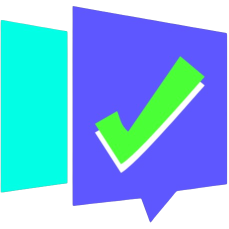
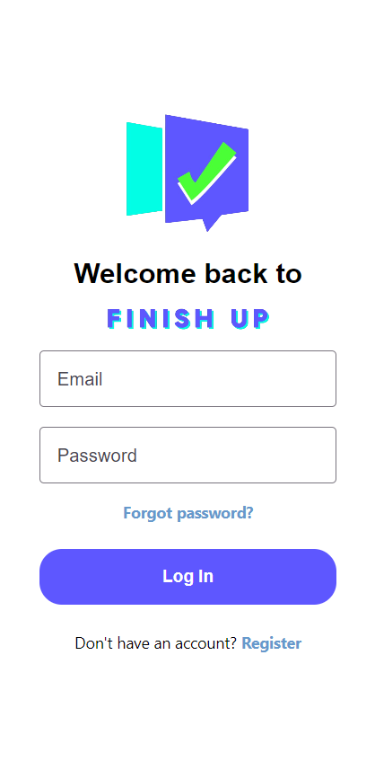
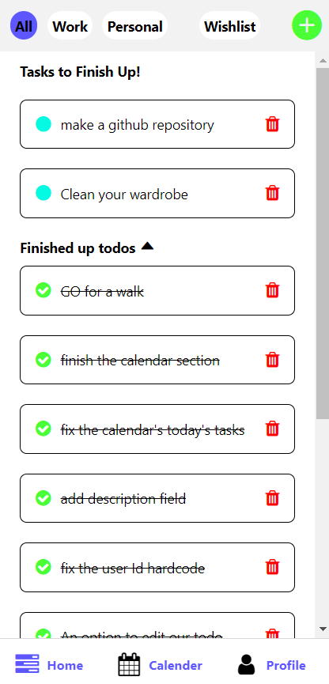
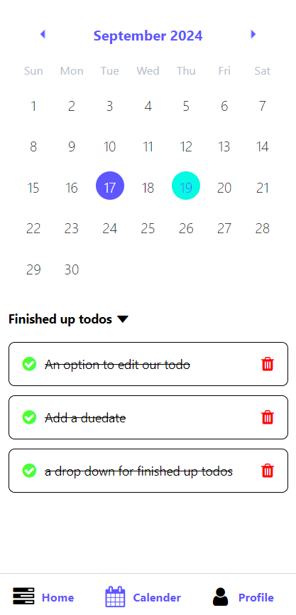
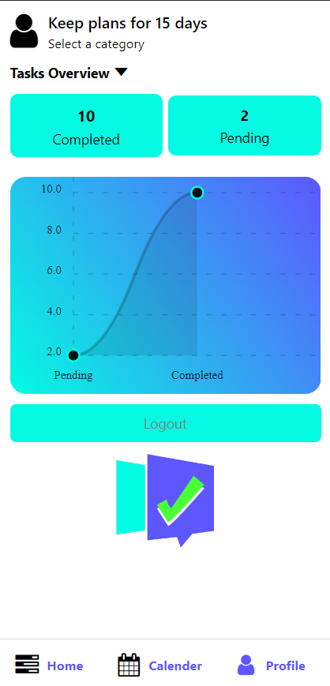
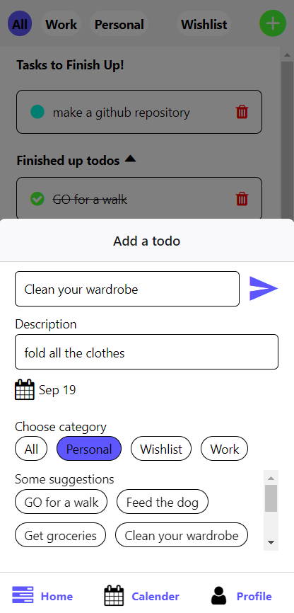
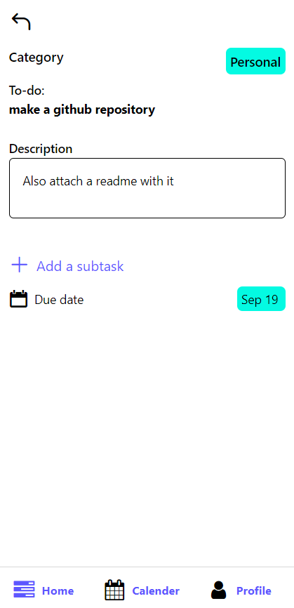

  

Welcome to **Finish Up**, a cross-platform mobile app built using **React Native** and **Expo**. This app allows users to manage their tasks effortlessly by organizing, tracking, and filtering their to-dos with a smooth user experience.


---

## ✨ Features

- **Login System**: Sync your tasks across multiple devices with secure login.
- **To-do Management**: Add, edit, and manage your tasks with titles, due dates, and descriptions.
- **Categorized To-dos**: Filter your tasks by categories such as 'All', 'Work', 'Personal', and more.
- **Task Editing**: Easily modify task details (title, due date, description) anytime.
- **Calendar Overview**: Visualize your task completion history with a day-wise breakdown.
- **Profile Section**: Track your productivity with a line graph comparing pending and completed tasks.

---

## 🚀 Technologies Used

- **Frontend**: React Native (Expo)
- **Backend**: Node.js with Nodemon
- **Database**: MongoDB
- **Authentication**: Login system to sync tasks across devices

---

## 📱 Screenshots

| Login Screen             | Home screen               | Calendar View            |
|-------------------------|----------------------------|--------------------------|
|   |  |  |

|Profile with Graph | Add a task        | Info and Edit page |
|-------------------------|-----------------------------|-------------------------|
|  |  |   |

---

## 🔧 Installation

1. **Clone the repository:**

   ```bash
   git clone https://github.com/NancyAanchal/FinishUp.git
2. **Install dependencies:**
   ```bash
   npm install
3. Run the app:
   ```bash
    npx expo start
4. Start the backend server:
    ```bash
    cd api
    npm install
    yarn start
    
🗂️ Project Structure
```perl

    
    📂 api
    ├── index.js        # Backend logic
    ├── ...              
    📂 app
    ├── (authenticate)/
    |     ├── _layout.js
    |     ├──login.js
    |     ├──register.js         
    ├── (tabs)/
    |     ├──_layout.js
    |     ├──home/
    |     ├──calendar/
    |     ├──profile/      
    ├── components/         
    └── index.js            
    └── StartingPage.js
